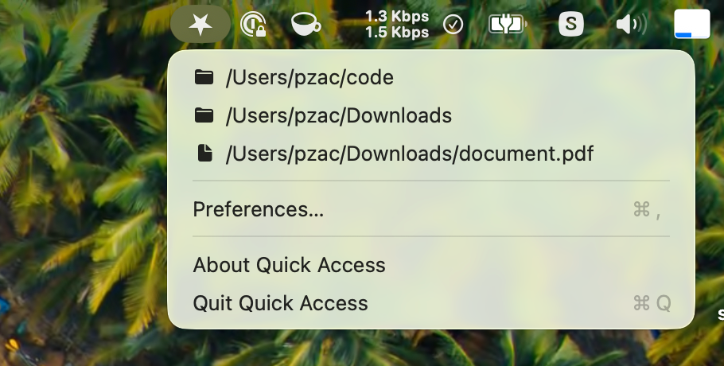

# Quick Access

A macOS menu bar app for quick access to your favourite files and folders.

This was an experiment to see how Claude Code deals with MacOs apps.



## Features

- Add files and directories to a favorites list
- Click a directory to open it in Finder
- Click a file to open it with the default app
- Remove individual favorites or all at once
- Optional automatic start at login
- Favorites persist across app restarts

## Requirements

- macOS 13.0+
- Swift 5+

## Build

```bash
./build.sh
```

This compiles the app and produces `Quick Access.app` in the project directory.

## Run

```bash
open "Quick Access.app"
```

To launch at login, copy `Quick Access.app` to `/Applications/` and add it to System Settings > Login Items.

## License

[MIT](LICENSE)
